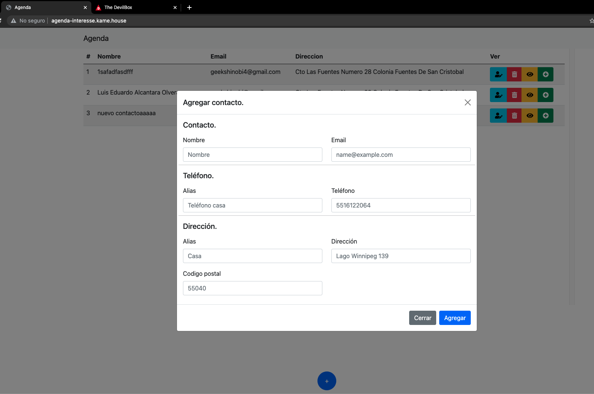

<p align="center"><a href="https://laravel.com" target="_blank"></a></p>

<p align="center">
<a href="https://travis-ci.org/laravel/framework"></a>
<a href="https://packagist.org/packages/laravel/framework"></a>
<a href="https://packagist.org/packages/laravel/framework"></a>
<a href="https://packagist.org/packages/laravel/framework"></a>
</p>

# Vista previa

<p align="center"></p>

## Configuración inicial

Después de clonar el proyecto se debe realizar las siguientes configuraciones.

## Instalaciones requeridas

Instalamos lo requerido con composer, para esto en la terminal ejecutamos:

`composer i`

Instalamos los paquetes requeridos de node:

`npm i`

Para crear el enlace simbólico:

`php artisan storage:link`

## Crear archivo .env

En la terminal hay que ejecutar el siguiente comando:

`cp .env.example .env`

## Crear key requerida en laravel

Creamos la APP key que require laravel en su archivo `.env`

`php artisan key:generate`

## Crea tu base de datos en mysql

En tu mysql crea una base de datos llamada: `agenda_interesse`:

En el archivo `.env` vamos a editar el apartado de conexión colocando los valores requeridos para tu conexion a MySql:

```env
DB_CONNECTION=mysql
DB_HOST=127.0.0.1
DB_PORT=3306
DB_DATABASE=agenda_interesse
DB_USERNAME=root
DB_PASSWORD=pass
```

## Crear migraciones

Para terminar hay que ejecutar:

`php artisan migrate`

Por ultimo hay que ejecutar:

`npm run dev` o `npm run watch`
